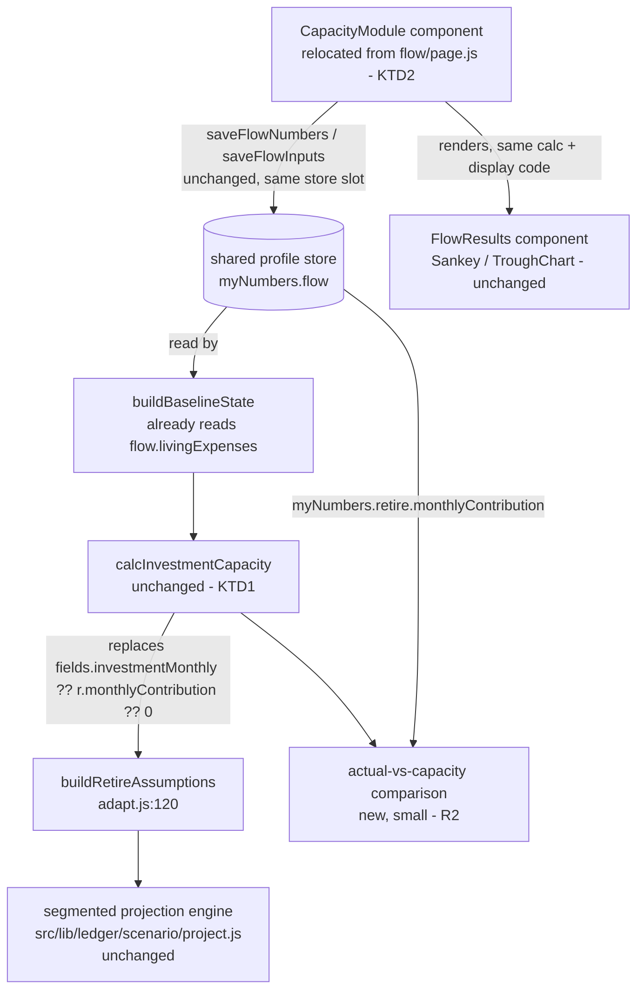

# FlowState into MyLedger - Plan

## Goal Capsule

- **Objective:** MyLedger becomes the single source of truth for "how much can I invest per month" — computed from real income, obligations, and measured living expenses, not a manually-typed assumption sitting beside a different tool's different number for the same-sounding question.
- **Means:** Dissolve FlowState as a standalone top-level tool. Its measurement flow (CPF/cash split, month-by-month living-expense walk, lumpy one-off items) becomes a module inside `/ledger`, feeding a capacity figure that MyLedger's multi-year projection uses directly — replacing the current manual `investmentMonthly` field. (session-settled — see Key Decisions)
- **Product authority:** User is product owner. Chosen explicitly over two narrower alternatives raised during brainstorm: (a) a small wiring fix that surfaces FlowState's computed capacity as a second labeled option alongside RetireWell's actual-contribution figure, and (b) keeping `/flow` as a standalone tool that only exports synced numbers. Both were rejected — the user's read is that two different numbers answering "how much can I invest" is itself the disparity, and a picker between them doesn't resolve it, only relocates it.
- **Open blockers:** None. The Product Contract's Outstanding Questions are resolved (KD4–KD7) and the Planning Contract's five Implementation Units are scoped against every file this plan touches, read in full. No code has been written under this plan yet — U1 is the first step.

---

## Product Contract

### Summary

Today, FlowState (`/flow`) and MyLedger (`/ledger`) each answer a version of "how much am I actually able to invest each month," and disagree by construction: FlowState computes it precisely (take-home minus all obligations minus a measured living-expense figure, via `calcInvestmentCapacity` in `src/lib/ledger/calc.js`); MyLedger's multi-year scenario projection instead uses a fully manual `assumptions.investmentMonthly` field, softly hinted from RetireWell's separate "current contribution" number — a different concept (what you're putting away today) wearing the same units as capacity (what your income structurally allows). `calcInvestmentCapacity` and `buildCapacitySchedule` already exist in MyLedger's own calc module but are today called only by FlowState's own `Results.js` component, never by MyLedger's own projection.

This plan folds FlowState into MyLedger as a module: its inputs and measurement flow move into `/ledger`'s own surface, and its capacity output becomes the number the ledger's projection authoritatively uses. `/flow` as a separate homepage tile and route goes away.

### Problem Frame

Every natdtm tool resolves one decision in isolation by design — that's the product's whole shape (see the Scenario Planner plan's Problem Frame for the general version of this). FlowState and MyLedger are the one pair where that isolation produces an actual contradiction rather than just an incomplete picture: both claim to answer "how much can I invest," from different math, and nothing reconciles them. A user who has run both sees two numbers and has no way to know which the ledger's own retirement projection is actually using (today: neither — it's whatever they typed).

### Key Decisions

- KD1. **Capacity is the canonical "monthly invested" figure; the manual assumption field is removed.** MyLedger's projection always uses `calcInvestmentCapacity`'s output (take-home − obligations − living expenses) once those three inputs are available. RetireWell's `monthlyContribution` (what the user is actually contributing today) becomes a secondary, informational comparison — e.g. "you're investing S$400/mo below your capacity" — never a competing default for what the projection assumes. (session-settled: user-directed — chosen over making "actual" canonical, and over a source-conditional rule that defers to whichever tool ran most recently.)
- KD2. **FlowState's measurement flow moves into MyLedger as a module, not a cross-tool sync.** The salary/CPF/cash split, the month-by-month living-expense walk (quick vs. detailed mode), and lumpy one-off items — the actual mechanism that produces the three inputs `calcInvestmentCapacity` needs — relocate into `/ledger`'s own surface as a distinct section/tab, alongside the existing Position / Assumptions / Scenarios structure. `/flow` and `/flow/the-math` cease to exist as standalone routes and homepage tiles. (session-settled: user-directed — chosen explicitly over keeping `/flow` standalone and having MyLedger only read its synced output; the user's stated goal is a single tool, not a better sync.)
- KD3. **The module boundary doubles as MyLedger's progressive-disclosure fix.** `docs/backlog.md` already flags MyLedger's current page as ~9,200px of ~20 always-rendered inputs with no progressive disclosure. Introducing a real module/tab structure to hold the absorbed FlowState flow is the same structural change that backlog item calls for — this plan does not additionally invent a second tabbing mechanism. (session-settled: user-directed — "flowstate as a module within MyLedger.") Governs R7, R8.
- KD4. **`/flow` and `/flow/the-math` return a hard 410, not a redirect.** Cleanest signal that FlowState no longer exists as a standalone tool, consistent with KD2's full dissolution rather than a soft deprecation. Accepted cost: a bookmarked or search-indexed `/flow` link dead-ends rather than forwarding into the new module. (session-settled: user-directed — chosen over a redirect to `/ledger` and over leaving `/flow` live as an undiscoverable deep link.) Governs R6.
- KD5. **No profile-store version bump.** The `flow` slot's shape (`livingExpenses`, `monthlySurplus`, `trueSavingsRate`, `cashSavingsRate`, `inputs`) is unchanged by this plan — only which page reads and writes it changes. `profile.js`'s version field tracks store-shape changes (e.g. the `v4 → v5` bump that added the `flow` slot itself), not which route owns a slot. (session-settled: user-directed.) Governs R8.
- KD6. **Module order: Position → Capacity → Assumptions → Scenarios.** Capacity sits immediately after Position and before Assumptions — it reads as "here's what you have, here's what you can invest," established before the forward-looking assumption bundles that consume that number. Assumptions' current manual "Monthly invested" field is replaced by a read-only figure sourced from Capacity (R1), so this ordering puts the source ahead of its consumer. (session-settled: user-directed — chosen over folding Capacity into Assumptions as a sub-section, and over ordering it last as an optional deep-dive.) Governs R7.
- KD7. **FlowState's "the math" content merges into `/ledger/the-math` as a new section**, matching the module living inside `/ledger` itself — one explainer page for everything `/ledger` now does, mirroring KD2's "one tool" framing. (session-settled: user-directed — chosen over keeping a standalone explainer page linked from within the module.) Governs R6.

### Requirements

#### Capacity as canonical

- R1. `calcInvestmentCapacity` (take-home − obligations − living expenses) is the figure MyLedger's multi-year projection uses for its monthly-invested assumption. The existing manual `assumptions.investmentMonthly` field is removed from the assumptions panel, not merely defaulted.
- R2. RetireWell's synced `monthlyContribution`, when present, is surfaced as a labeled comparison against the computed capacity (a delta, not a second input) — e.g. above/below capacity, by how much.
- R3. If the inputs `calcInvestmentCapacity` needs (take-home, obligations, living expenses) are incomplete — the absorbed module hasn't been filled in — the projection falls back to a value of `0`, the same "don't fabricate a number" convention MyLedger already uses elsewhere (see `resolveReference`'s `source: 'none'` case), with a visible reason rather than a silent wrong number.

#### FlowState absorption

- R4. The CPF/cash income split, the living-expense measurement (quick and detailed modes), and lumpy one-off items move from `/flow`'s page into a module inside `/ledger`. The underlying calc functions (`buildMonthlyFlow`, `quickLivingExpenses`, `detailedLivingExpenses`, `trueSavingsRate`, `cashSavingsRate`, `fixedCostRatio`, `runwayMonths` in `src/lib/flow/calc.js`) are reused, not reimplemented — same reuse posture as the Scenario Planner plan's KD1 (reuse RetireWell's engine; don't fork it).
- R5. FlowState's own results view (the Sankey diagram, before/after capacity comparison) is preserved inside the new module — this plan absorbs the tool, it does not delete its output, only its standalone-ness.
- R6. `/flow` and `/flow/the-math` are removed from the homepage grid and the shell header's tool switcher, and return a hard 410 rather than redirecting (KD4). FlowState's explainer content merges into `/ledger/the-math` as a new section rather than surviving as its own page (KD7).
- R7. The absorbed module renders as a distinct, collapsed-by-default section of `/ledger`, ordered Position → Capacity → Assumptions → Scenarios (KD6) — not inline fields interleaved with Position/Assumptions — satisfying KD3.
- R8. Existing users' saved FlowState data (`myNumbers.flow.inputs`, written by `saveFlowInputs`) continues to restore correctly inside the new module location — this is a UI relocation, not a data-loss event. The existing `flow` slot schema (`livingExpenses`, `monthlySurplus`, `trueSavingsRate`, `cashSavingsRate`, `inputs`) does not change shape for this plan; no store-version bump (KD5).

### Key Flows

- F1. **A user who has never touched FlowState opens `/ledger`.** They see Position, Assumptions, Scenarios, and a collapsed "Monthly capacity" module. The projection's monthly-invested figure reads 0 (or their RetireWell-synced actual contribution, per R2's comparison framing) until they open and fill in the module.
- F2. **A user who previously used FlowState opens `/ledger` after this ships.** Their saved inputs restore into the new module location (R8); the module is not collapsed by default for them since real data exists there. The projection immediately reflects the computed capacity.
- F3. **A user opens the capacity module, fills in salary/CPF split/living expenses/lumpy items**, sees the same Sankey/results view FlowState used to show, and the ledger's own "Monthly invested" figure (now read-only, computed) updates live — no separate "save to sync" step, matching MyLedger's existing "autosaved as you type, nothing to press" convention.
- F4. **A user with a RetireWell-synced `monthlyContribution` and a filled-in capacity module** sees both: the projection uses capacity; a comparison line shows the actual-vs-capacity delta (R2).

### Acceptance Examples

- AE1. Given a filled capacity module producing `calcInvestmentCapacity` = 1,200 and a synced `retire.monthlyContribution` = 800, when the assumptions panel renders, then the projection uses 1,200 and a comparison reads "S$400/mo below your capacity" (or equivalent). Covers R1, R2.
- AE2. Given no capacity-module inputs and no synced `retire.monthlyContribution`, when the projection renders, then the monthly-invested figure is 0 with a visible "fill in your capacity" prompt, not a blank silently treated as a real zero. Covers R3.
- AE3. Given a user with pre-existing `myNumbers.flow.inputs` from before this ships, when they open `/ledger` post-migration, then those inputs populate the capacity module exactly as they populated `/flow` before. Covers R8.
- AE4. Given the capacity module is open and a lumpy one-off item is added, when the Sankey/results view re-renders, then it matches what FlowState's standalone `Results.js` would have shown for the same inputs today (same calc functions, same output). Covers R4, R5.

### Success Criteria

- MyLedger's multi-year projection never uses a manually-typed "monthly invested" number again — every path to that figure runs through `calcInvestmentCapacity`.
- The homepage grid drops from 8 tiles to 7; no route still advertises FlowState as a standalone decision.
- No existing user's saved FlowState inputs are lost across the change (AE3).
- `docs/backlog.md`'s MyLedger progressive-disclosure item is resolved as a side effect, not left open alongside a new module bolted onto the same flat page.

### Scope Boundaries

**In scope:** the capacity module's UI and inputs inside `/ledger`; wiring `calcInvestmentCapacity`'s output into the scenario projection in place of the manual field; the actual-vs-capacity comparison display; removing `/flow` from navigation.

**Out of scope:** `trueSavingsRate` and `cashSavingsRate` remain computed and stored but unused by any downstream calculation — same as today; this plan doesn't find them a consumer, it only fixes `monthlySurplus`. Redesigning MyLedger's *other* sections (Position, Scenarios) beyond what's needed to host the new module. Any change to RetireWell's own `monthlyContribution` field or `/retire` itself.

### Dependencies & Assumptions

- Assumes MyLedger's existing autosave-per-keystroke pattern extends cleanly to a new module without a redesign of the persistence layer itself (`src/lib/shared/profile.js`'s `flow` slot already exists and already supports this shape).
- Assumes the Scenario Planner rebuild (the other recent plan in `docs/plans/`) is stable ground to build on top of, not itself mid-change.

### Outstanding Questions

None remaining at the requirements level — the four forks (route fate, schema version, module order, "the math" placement) are resolved as KD4–KD7 above. What's still open is the Planning Contract itself (Key Technical Decisions on *how* the capacity module's code is structured, Implementation Units) — a different kind of work, not a gap in these requirements.

---

## Planning Contract

### Key Technical Decisions

- KTD1. **The canonical-capacity wiring is a one-line precedence change, not new plumbing.** `calcInvestmentCapacity(state)` (`src/lib/ledger/calc.js:381`) already exists, is already pure, and already operates on `buildBaselineState(myNumbers)` — which already reads `flow?.livingExpenses` from the shared store (the comment at `calc.js:69` documents this: "FlowState's measured monthly living spend"). The only code that needs to change is `buildRetireAssumptions` in `src/lib/ledger/scenario/adapt.js:120`, whose precedence today is `fields.investmentMonthly ?? r.monthlyContribution ?? 0` (manual field, else RetireWell's synced actual contribution, else zero). This becomes `calcInvestmentCapacity(buildBaselineState(myNumbers))`, full stop — `fields.investmentMonthly` is deleted from the function's inputs entirely (R1: removed, not defaulted). `adapt.js` already receives `myNumbers` as its first argument, so no new data has to reach it. Implements R1.
- KTD2. **The Capacity module is FlowState's existing page relocated, not rebuilt.** `src/app/flow/page.js`'s state, effects, and JSX move into a new `src/components/ledger/CapacityModule.js`, rendered inside `/ledger`. It keeps calling the exact same functions it calls today (`buildMonthlyFlow`, `quickLivingExpenses`/`detailedLivingExpenses`, `buildTwelveMonthSchedule`, `findTightestMonth`, `compareGiroToLump` from `src/lib/flow/calc.js`) and keeps writing through the exact same store functions (`saveFlowNumbers`, `saveFlowInputs` in `src/lib/shared/profile.js`) — the module changes where this code renders, not what it computes or where it persists. Implements R4, R5, KD2.
- KTD3. **Two different "take-home" figures stay, deliberately, for two different jobs.** FlowState's own results view (`src/components/flow/Results.js:51-63`) computes `calcInvestmentCapacity` using its *own* locally-derived `flow.cash` (salary minus CPF minus tax, computed fresh inside `buildMonthlyFlow` so the Sankey and the capacity figure are internally consistent with each other) — not `state.monthlyTakeHome` from TaxWise. The canonical ledger-wide capacity (KTD1) instead goes through `calcTakeHome(state)`, which prefers TaxWise's exact synced figure and falls back to the flat 80% approximation — the same take-home definition every other ledger calculation already uses. These can legitimately disagree by a small amount (TaxWise's synced figure vs. FlowState's own recompute of the same thing) without it being a bug: the module's internal view answers "does this month's flow add up," the ledger's canonical figure answers "what does the rest of the ledger's math assume," and conflating them would make the Sankey's own numbers stop summing to what's on screen. Not a defect to fix — a boundary to document so nobody "fixes" it later by accident.
- KTD4. **`/flow` and `/flow/the-math` return a true HTTP 410 via a Route Handler, not Next's `notFound()`.** Next.js's idiomatic page-removal mechanism (`notFound()`) renders the app's 404 page with a 404 status — it does not produce a 410. KD4 asked for a 410 specifically ("cleanest signal the tool no longer exists," distinct from "was never here"). The codebase already has route-handler precedent (`src/app/drive/api/*/route.js`) for returning a custom `Response`; the same pattern converts `src/app/flow/page.js` and `src/app/flow/the-math/page.js` into `route.js` handlers returning `new Response(null, { status: 410 })` for any method. **Refinement to KD4:** the settled decision (hard 410) stands; this is the specific mechanism that actually delivers it, since the framework's default tooling delivers a different status than what was asked for.
- KTD5. **FlowState's "the math" content is inserted as a new section in `/ledger/the-math`, ordered to match KD6's module order** (after whatever section explains Position, before Assumptions) — mirrors the page structure, not just the code structure. Implements R6, KD7.

### High-Level Technical Design

Nothing inside the dashed unchanged boxes is touched by this plan — the work is entirely in relocating `CM`'s rendering location, deleting the manual-field path into `BRA`, and adding the small `CMP` comparison. This is a much smaller technical footprint than the Scenario Planner rebuild: no new algorithm, no new persisted shape, one precedence change in one existing pure function.

### Assumptions

- `calcInvestmentCapacity` and `buildCapacitySchedule` need no changes — both already accept the exact `state` shape `buildBaselineState` already produces. Confirmed by reading both in full (`src/lib/ledger/calc.js:381-437`).
- The `flow` slot's existing `saveFlowNumbers`/`saveFlowInputs`/`loadFlowInputs` functions in `src/lib/shared/profile.js` need no changes (KD5) — the relocated module calls them exactly as `/flow`'s page does today.
- `src/components/flow/Sankey.js` and `src/components/flow/TroughChart.js` are pure display components taking data as props (confirmed by full read) — they move alongside `Results.js` with no internal changes.
- MyLedger's existing autosave-per-keystroke convention (KTD9 in the Scenario Planner plan) extends to the relocated module's inputs without a persistence-layer redesign, since it writes to the same `flow` slot via the same functions.

### Sequencing

U1 (capacity wiring, no UI dependency) can proceed independently and in parallel with U2 (module relocation). U3 (wire the module into `/ledger`'s new section structure) depends on both U1 and U2. U4 (410 routes) and U5 (the-math merge) depend on U3 being live, so `/flow` isn't killed before its replacement exists.

---

## Implementation Units

### U1. Wire `calcInvestmentCapacity` into the scenario assumptions

- **Goal:** `buildRetireAssumptions` uses computed capacity as the sole source of the projection's monthly-invested figure; the manual override is removed.
- **Requirements:** R1, R3. Implements KTD1.
- **Dependencies:** none.
- **Files:** `src/lib/ledger/scenario/adapt.js`, `src/lib/ledger/scenario/adapt.test.js`.
- **Approach:** In `buildRetireAssumptions(myNumbers, fields)`, replace `investmentMonthly: fields.investmentMonthly ?? r.monthlyContribution ?? 0` with `investmentMonthly: calcInvestmentCapacity(buildBaselineState(myNumbers))`. Remove `investmentMonthly` from the `fields` shape callers pass (it becomes dead if still passed, so also remove it from `src/app/ledger/page.js`'s call site in the same unit rather than leaving an unused field behind). Add the `calcInvestmentCapacity`/`buildBaselineState` imports.
- **Test scenarios:**
  - Covers R1. Given `myNumbers.flow.livingExpenses = 800`, `myNumbers.tax.monthlyTakeHome = 5000`, a house instalment of 1500 and no car, `buildRetireAssumptions` returns `investmentMonthly = 2700` (5000 − 1500 − 800), matching a direct `calcInvestmentCapacity` call on the same inputs.
  - Covers R3. Given no `flow` slot and no `tax` slot (nothing synced), `investmentMonthly` is `0`, not `NaN` or a thrown error.
  - A previously-passing test asserting the old manual-field precedence is updated or removed, not left asserting removed behavior.
- **Verification:** `adapt.test.js` passes; a manual check that `/ledger`'s projection changes when `flow.livingExpenses` changes, without any assumptions-panel interaction.

### U2. Extract FlowState's page into a reusable Capacity module component

- **Goal:** `src/components/ledger/CapacityModule.js` contains FlowState's state, effects, and JSX, importable and renderable standalone (not yet wired into `/ledger`'s page — that's U3).
- **Requirements:** R4, R5. Implements KTD2.
- **Dependencies:** none.
- **Files:** `src/components/ledger/CapacityModule.js` (new), `src/components/flow/Results.js` (moves to `src/components/ledger/CapacityResults.js`), `src/components/flow/Sankey.js` and `src/components/flow/TroughChart.js` (move under `src/components/ledger/`, no internal changes — both are pure display components taking data via props, confirmed by a full read: `Sankey` takes `{ flow }`, `TroughChart` takes `{ primary, alt, events, troughMonth, tone }`, neither reaches into routing, storage, or anything route-specific), `src/components/ledger/ui.js` (extended, not duplicated — see below).
- **Approach:** Copy `src/app/flow/page.js`'s body (state hooks, mount/restore effect, autosave effect, the `buildMonthlyFlow`/`buildTwelveMonthSchedule` memoized calls, the JSX) into the new component with minimal changes — primarily removing the page-level concerns (`ShellHeader`, the top-level route wrapper) since those belong to `/ledger`'s page, not this module. The component keeps its own collapsed/expanded local state (KD3/R7) but the initial value comes from a prop (`hasExistingData`) so U3 can decide "expand by default when the user has prior FlowState data" (F2) without the module needing to know about the ledger page's other sections. **`src/components/flow/ui.js` is not moved as-is** — a full read shows `SectionDivider`, `MoneyInput`, `PercentInput`, `NumberInput`, and `Segmented` are near-duplicates of components `src/components/ledger/ui.js` already exports (same signatures, same visual treatment, down to the `borderControl` token from PR #11 — both files were touched by that same PR). The module imports these from `ledger/ui.js` instead of dragging a second copy along; only `Toggle` (the boolean pill button, e.g. "I have a mortgage") is genuinely new to `ledger/ui.js` and gets added there. `src/components/flow/ui.js` is deleted once nothing imports from it.
- **Test scenarios:**
  - No new calc logic is introduced, so no new `.test.js` — existing `src/lib/flow/calc.test.js` coverage is unchanged and still exercises the functions this component calls.
  - Manual/e2e: rendering `CapacityModule` standalone with a mocked `myNumbers.flow` payload reproduces the same Sankey and metrics `/flow`'s page shows today for the same inputs (this is the acceptance bar for "relocated, not rebuilt").
- **Verification:** Visual diff against `/flow`'s current rendering for an identical input set, before `/flow` itself is removed (U4) — this unit should ship and be checked while both the old page and the new component exist side by side, so there's a live reference to compare against.

### U3. Wire the Capacity module into `/ledger`'s section structure

- **Goal:** `/ledger` renders Position → Capacity → Assumptions → Scenarios (KD6); Assumptions' manual "Monthly invested" field becomes a read-only computed figure with the actual-vs-capacity comparison (R2).
- **Requirements:** R2, R7, F1-F4. Implements KD3, KD6.
- **Dependencies:** U1, U2.
- **Files:** `src/app/ledger/page.js`.
- **Approach:**
  1. Insert `<CapacityModule ... />` between the existing Position section and the Assumptions section.
  2. `hasExistingData` prop (U2) computed from whether `myNumbers.flow?.inputs` exists — collapsed by default otherwise (F1), expanded when it does (F2).
  3. In the Assumptions section, replace the `MoneyInput id="a-contrib"` field (`page.js:308`) with a read-only display of `calcInvestmentCapacity(buildBaselineState(myNumbers))`, plus the R2 comparison line when `myNumbers.retire?.monthlyContribution` is present: the delta and its sign (above/below capacity).
  4. Remove `investmentMonthly` from the local `assumptions` state object (`page.js:36`) entirely — nothing manual to track.
- **Test scenarios:**
  - Covers AE1. Given capacity = 1,200 and `retire.monthlyContribution` = 800, the comparison reads "S$400/mo below your capacity" (exact copy TBD at implementation, this is the acceptance bar).
  - Covers AE2. Given neither capacity inputs nor a synced RetireWell contribution, the figure reads 0 with a visible prompt to fill in the Capacity module, not a bare "S$0".
  - Covers F1/F2. A fresh profile shows the module collapsed; a profile with `flow.inputs` already present shows it expanded on load.
- **Verification:** `npm test` (existing ledger suite) plus a manual pass through F1-F4 in the running app.

### U4. Remove `/flow` and `/flow/the-math`; return 410

- **Goal:** Both routes return HTTP 410; neither appears in the homepage grid or the shell header's tool switcher.
- **Requirements:** R6. Implements KD4 (refined by KTD4).
- **Dependencies:** U3 (the replacement must be live first).
- **Files:** `src/app/flow/page.js` → `src/app/flow/route.js`; `src/app/flow/the-math/page.js` → `src/app/flow/the-math/route.js`; the homepage tool grid data source (`tools.js` or equivalent, per the README's "tool count matches `tools.js`" convention referenced in the craft-roadmap plan); `src/components/shared/ShellHeader.js`'s tool-switcher list.
- **Approach:** Each `route.js` exports handlers for the methods a browser navigation actually sends (`GET` at minimum) returning `new Response(null, { status: 410 })`. Remove the FlowState entry from the tools data source and the switcher list. Delete `src/app/flow/` page files once the route handlers replace them (a directory can hold either a `page.js` or a `route.js` for a given path, not both).
- **Test scenarios:**
  - Covers R6. `GET /flow` and `GET /flow/the-math` both return status 410.
  - The homepage renders 7 tool tiles, not 8; FlowState does not appear in the shell header's switcher.
  - The existing Playwright visual suite's page list (`e2e/visual.spec.js`) is updated to drop `/flow` from the pages it screenshots, or it will fail against a route that now 410s.
- **Verification:** `npm test`; `npm run build`; the visual suite passes with `/flow` removed from its target list.

### U5. Merge FlowState's "the math" content into `/ledger/the-math`

- **Goal:** The explainer content from `src/app/flow/the-math/page.js` (now removed per U4) exists as a section within `/ledger/the-math`.
- **Requirements:** R6. Implements KD7.
- **Dependencies:** U4 (source content is being removed in the same broader change; do this before deleting the file, or copy the content out first).
- **Files:** `src/app/ledger/the-math/page.js`.
- **Approach:** Insert the CPF/cash-split and living-expense-measurement explainer content as a new section, positioned to match the Capacity module's position in `/ledger` itself (KD7) — after whatever section explains Position/net-worth, before the Assumptions explainer.
- **Test scenarios:** No new calc logic; this is a content move. Manual check that every explanation FlowState's the-math page made is still findable somewhere in `/ledger/the-math` post-merge — a checklist diff between the old page's headings and the new section's headings is sufficient verification, not a new test file.
- **Verification:** `npm run build`; manual content-completeness check.

## Post-Plan Menu

- Implement U1 → U2 → U3 → U4 → U5 in that dependency order (U1/U2 can run in parallel with each other).
- Start `ce-work` (or the equivalent execution step) directly against this document — every file this plan touches has now been read in full (not just sampled at call sites): `src/lib/flow/calc.js`, `src/lib/ledger/calc.js`, `src/components/flow/Results.js`, `src/components/flow/Sankey.js`, `src/components/flow/TroughChart.js`, `src/components/flow/ui.js`, and the `investmentMonthly` call chain across `src/app/ledger/page.js` and `src/lib/ledger/scenario/adapt.js`/`index.js`/`project.js`.
